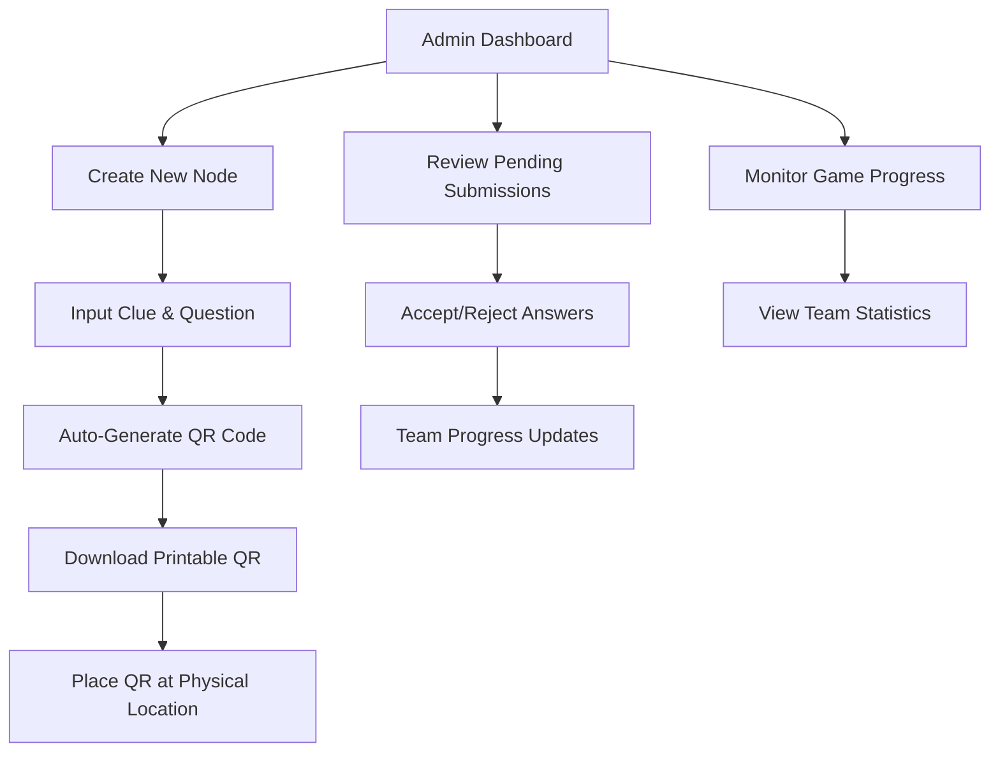

# Treasure Hunt Application - Complete Documentation

## 🎯 System Overview

A real-time, interactive treasure hunt game system with jungle/explorer theming. Players work in teams to progress through a series of nodes by scanning QR codes at physical locations and answering questions. Administrators create nodes, manage the game flow, and manually approve submissions for fair gameplay.

## 🏗️ System Architecture

### Technology Stack
- **Frontend**: Next.js with React
- **Backend**: Convex (real-time database)
- **Animations**: Framer Motion, React Konva
- **QR Generation**: qrcode library
- **Styling**: Tailwind CSS

### Core Features
- Interactive animated node map
- Automated QR code generation and printing
- Real-time team progress tracking
- Manual admin approval system
- Live leaderboard updates
- Mobile-responsive design

## 📊 Database Schema

### Tables Structure

```javascript
// Teams table
table Teams {
  id: string;
  name: string;
  members: string[];
  currentStage: number;
  score: number;
  createdAt: timestamp;
}

// Nodes table
table Nodes {
  id: number;
  clue: string;
  question: string;
  correctQrCode: string;
  expectedAnswer?: string;
  createdAt: timestamp;
  isActive: boolean;
}

// Submissions table
table Submissions {
  id: string;
  teamId: string;
  nodeId: number;
  submittedAnswer: string;
  status: "pending" | "accepted" | "rejected";
  submittedAt: timestamp;
  reviewedAt?: timestamp;
  reviewedBy?: string;
}

// Game Settings table
table GameSettings {
  id: string;
  totalNodes: number;
  gameActive: boolean;
  pointsPerNode: number;
}
```

## 🎮 User Flows

### 1. Team Setup Flow
1. **Landing Page**: Welcome screen with jungle theme
2. **Team Creation**: 
   - Create new team (team name + member names)
   - Join existing team (team code)
3. **Dashboard Redirect**: After successful setup

### 2. Player Gameplay Flow
```mermaid
graph TD
    A[Team Dashboard] --> B[View Interactive Node Map]
    B --> C[Current Node: View Clue]
    C --> D[Navigate to Physical Location]
    D --> E[Scan QR Code]
    E --> F{QR Code Valid?}
    F -->|No| G[Show "Haha wrong place!" Animation]
    F -->|Yes| H[Display Question Form]
    H --> I[Submit Answer]
    I --> J[Wait for Admin Approval]
    J --> K{Admin Decision}
    K -->|Approved| L[Progress to Next Node + Animation]
    K -->|Rejected| M[Try Again]
    L --> N[Update Leaderboard]
    G --> D
    M --> H
```

### 3. Admin Management Flow


## 🔧 Core Functions

### Node Management
```javascript
// Create a new node with auto-generated QR
export async function createNode(ctx, { clue, question, expectedAnswer }) {
  const generatedQrCode = generateUUID();
  const nodeId = await ctx.db.insert("nodes", {
    clue,
    question,
    correctQrCode: generatedQrCode,
    expectedAnswer,
    isActive: true,
    createdAt: Date.now()
  });
  
  return {
    nodeId,
    qrCodeData: JSON.stringify({
      nodeId,
      qrSecret: generatedQrCode
    })
  };
}

// Validate QR code scan
export async function validateQRCode(ctx, { teamId, scannedData }) {
  const team = await ctx.db.get(teamId);
  const parsedQR = JSON.parse(scannedData);
  const node = await ctx.db.get(parsedQR.nodeId);
  
  // Check if team is at correct stage
  if (team.currentStage !== parsedQR.nodeId) {
    return { valid: false, message: "Wrong sequence! Complete previous nodes first." };
  }
  
  // Validate QR secret
  if (parsedQR.qrSecret !== node.correctQrCode) {
    return { valid: false, message: "Haha wrong place! Keep exploring!" };
  }
  
  return { valid: true, node };
}
```

### Submission Management
```javascript
// Submit answer for manual review
export async function submitAnswer(ctx, { teamId, nodeId, answer }) {
  const submissionId = await ctx.db.insert("submissions", {
    teamId,
    nodeId,
    submittedAnswer: answer,
    status: "pending",
    submittedAt: Date.now()
  });
  
  return submissionId;
}

// Admin approve/reject submission
export async function reviewSubmission(ctx, { submissionId, approved, adminId }) {
  const submission = await ctx.db.get(submissionId);
  
  await ctx.db.patch(submissionId, {
    status: approved ? "accepted" : "rejected",
    reviewedAt: Date.now(),
    reviewedBy: adminId
  });
  
  if (approved) {
    const team = await ctx.db.get(submission.teamId);
    const settings = await ctx.db.query("gameSettings").first();
    
    await ctx.db.patch(team._id, {
      currentStage: team.currentStage + 1,
      score: team.score + settings.pointsPerNode
    });
  }
}
```

## 🎨 UI/UX Design Specifications

### Theme: Jungle Explorer
- **Color Palette**: 
  - Primary: Deep forest greens (#1a4d3a, #2d6e4e)
  - Secondary: Earthy browns (#8b4513, #a0522d)
  - Accents: Gold (#ffd700), Amber (#ffbf00)
  - Neutral: Stone grays (#696969, #778899)

### Interactive Node Map
- **Incomplete Nodes**: Grayscale with subtle pulse
- **Current Node**: Highlighted with golden glow animation
- **Completed Nodes**: Green with checkmark icon
- **Connection Lines**: Animated path showing progress
- **Particle Effects**: Subtle floating leaves/fireflies

### Animations
- **Node Transitions**: Smooth color changes with Framer Motion
- **QR Scan Feedback**: Camera overlay with scanning line
- **Wrong Location**: Gentle shake animation with emoji
- **Success States**: Celebratory particle burst
- **Leaderboard Updates**: Smooth position changes

## 📱 Component Structure

### Player Components
```
components/
├── player/
│   ├── Dashboard.jsx          # Main player interface
│   ├── NodeMap.jsx           # Interactive progress map
│   ├── QRScanner.jsx         # Camera QR scanning
│   ├── QuestionForm.jsx      # Answer submission
│   ├── Leaderboard.jsx       # Real-time rankings
│   └── TeamSetup.jsx         # Initial team creation
```

### Admin Components
```
components/
├── admin/
│   ├── AdminDashboard.jsx    # Main admin interface
│   ├── NodeCreator.jsx       # Create/edit nodes
│   ├── QRGenerator.jsx       # Generate & download QRs
│   ├── SubmissionReview.jsx  # Approve/reject answers
│   ├── GameMonitor.jsx       # Live game statistics
│   └── TeamManager.jsx       # Team administration
```

## 🔒 Security Considerations

### QR Code Security
- **UUID Generation**: Cryptographically secure random strings
- **JSON Structure**: Includes nodeId + secret for validation
- **Sequence Validation**: Teams must complete nodes in order
- **Timestamp Checks**: Prevent replay attacks

### Access Control
- **Admin Authentication**: Secure admin login system
- **Team Isolation**: Teams can only access their own data
- **Rate Limiting**: Prevent spam submissions
- **Input Validation**: Sanitize all user inputs

## 🚀 Deployment Configuration

### Environment Variables
```
CONVEX_URL=your_convex_url
NEXT_PUBLIC_CONVEX_URL=your_convex_url
ADMIN_SECRET_KEY=secure_admin_key
QR_ENCRYPTION_KEY=qr_encryption_key
```

### Build & Deploy
```bash
# Install dependencies
npm install

# Set up Convex
npx convex dev

# Build for production
npm run build

# Deploy to Vercel/Netlify
npm run deploy
```

## 📊 Admin Dashboard Features

### Node Management
- **Visual Node Editor**: Drag-and-drop interface for clues
- **QR Code Preview**: Live preview of generated QR codes
- **Batch Operations**: Create multiple nodes at once
- **Print Layout**: Optimized QR code printing templates

### Game Monitoring
- **Real-time Statistics**: Active teams, completion rates
- **Team Progress Visualization**: Interactive progress tracking
- **Submission Queue**: Pending answers with context
- **Game Controls**: Start/pause/reset game functionality

### Reporting
- **Team Performance**: Detailed analytics per team
- **Node Difficulty**: Success rates per question
- **Time Analytics**: Average completion times
- **Export Options**: CSV/PDF report generation

## 🎯 Scalability Features

### Performance Optimizations
- **Real-time Subscriptions**: Efficient Convex queries
- **Image Optimization**: Compressed QR code generation
- **Lazy Loading**: Progressive component loading
- **Caching Strategy**: Smart data caching

### Multi-Game Support
- **Game Templates**: Reusable node structures
- **Event Management**: Multiple concurrent games
- **Team Segregation**: Isolated game instances
- **Admin Hierarchy**: Multi-level admin access

## 🔍 Testing Strategy

### Unit Tests
- QR code generation/validation
- Team progression logic
- Scoring calculations
- Input sanitization

### Integration Tests
- Full player workflow
- Admin approval process
- Real-time updates
- Error handling

### User Acceptance Tests
- Mobile responsiveness
- QR scanning accuracy
- Animation performance
- Admin workflow efficiency

## 📚 API Documentation

### Player Endpoints
- `POST /api/teams/create` - Create new team
- `POST /api/teams/join` - Join existing team
- `POST /api/qr/scan` - Validate QR code
- `POST /api/answers/submit` - Submit answer
- `GET /api/leaderboard` - Get current rankings

### Admin Endpoints
- `POST /api/admin/nodes/create` - Create new node
- `GET /api/admin/submissions` - Get pending submissions
- `POST /api/admin/submissions/review` - Approve/reject
- `GET /api/admin/analytics` - Get game statistics

## 🎨 Customization Guide

### Theming
- Color scheme modification in `tailwind.config.js`
- Animation timing adjustments in Framer Motion configs
- Particle effect customization in Canvas components

### Content Management
- Clue templates for different game types
- Question difficulty levels
- Scoring system modifications
- Time limit configurations

---

*This documentation provides a complete foundation for building and deploying the treasure hunt application. For specific implementation details, refer to the individual component files and Convex function definitions.*